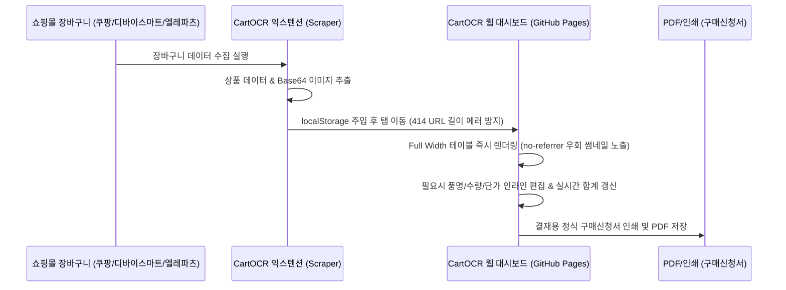

# 🛒 CartOCR: 장바구니 자동 문서화 & 구매신청서 생성기

> 쇼핑몰(쿠팡, 디바이스마트, 엘레파츠) 장바구니의 품목 리스트를 원클릭으로 스크래핑하고, 결재용 정식 구매신청서 양식(PDF/Markdown/CSV)으로 즉시 변환하는 서버리스 자동화 툴입니다.

---

## 🌟 주요 특징 (Key Features)

*   **100% 클라이언트 사이드 (Privacy-First)**: 데이터를 수집하고 연동하는 전 과정이 서버 없이 각 브라우저의 내부 저장소(`localStorage`)를 통해 이루어집니다. 회사 내부 구매 정보가 외부 서버에 절대 전송되거나 기록되지 않습니다.
*   **크롬 익스텐션 수집 연동**: 쿠팡, 디바이스마트, 엘레파츠 장바구니 페이지에서 단 한번의 클릭으로 실물 썸네일 이미지, 품명, 단가, 수량을 100% 정확하게 긁어옵니다.
*   **스마트 테이블 에디터 (Editable Grid)**: 스크래핑한 표 데이터의 품명, 수량, 가격을 대시보드 내에서 직접 더블클릭하여 수정할 수 있으며, 총금액이 실시간으로 자동 재계산됩니다.
*   **대표님 결재용 정식 구매신청서 출력 (Print & PDF)**: 브라우저 인쇄 모드 최적화 스타일을 적용하여, 개별 상품 썸네일 이미지가 포함된 깔끔한 결재 양식을 그대로 출력하거나 PDF로 저장할 수 있습니다.
*   **다양한 내보내기 포맷**: 노션/슬랙 표 작성을 위한 **Markdown Table 원클릭 복사** 기능 및 엑셀 연동을 위한 **CSV 다운로드(한글 깨짐 방지 BOM 적용)** 기능을 지원합니다.

---

## ⚙️ 시스템 아키텍처 및 데이터 흐름



---

## 🚀 설치 및 사용 방법 (How to Install & Use)

### 1. 크롬 익스텐션 설치
1. 본 저장소의 코드를 다운로드 받거나 [extension.zip](https://github.com/Seung-Won-Yu/cart-ocr/blob/main/extension.zip) 파일을 내려받아 압축을 해제합니다.
2. 크롬 브라우저를 열고 주소창에 `chrome://extensions/`를 입력해 이동합니다.
3. 우측 상단의 **[개발자 모드]** 스위치를 활성화합니다.
4. 좌측 상단 활성화된 **[압축해제된 확장 프로그램을 로드합니다]** 버튼을 클릭합니다.
5. 압축을 푼 `extension` 폴더를 통째로 지정하면 설치가 완료됩니다.

### 2. 장바구니 데이터 수집 및 문서화
1. 지원하는 쇼핑몰(쿠팡, 디바이스마트, 엘레파츠)의 장바구니 페이지로 이동합니다.
2. 품목이 담긴 상태에서 브라우저 툴바의 **CartOCR Scraper** 익스텐션 아이콘을 클릭합니다.
3. **[장바구니 상품 수집]**을 눌러 데이터를 추출한 뒤, **[CartOCR 앱으로 전송]**을 누릅니다.
4. 자동으로 웹 대시보드 창(`https://seung-won-yu.github.io/cart-ocr/`)이 열리며 썸네일을 포함한 품목 리스트가 자동 세팅됩니다.
5. 필요한 부분을 수정한 뒤 하단의 내보내기 도구 모음(노션용 복사, CSV 다운로드, PDF 출력)을 사용하세요!

---

## 🛠️ 커스터마이징 및 배포 (Customization & Deploy)

사용자 본인의 깃허브 계정에 개별 배포하여 사용하고 싶을 경우 다음 파일들의 도메인 설정을 변경하여 업로드합니다.

1. **`extension/manifest.json` 주소 변경**
   ```json
   "host_permissions": [
     "https://*.coupang.com/*",
     "https://*.devicemart.co.kr/*",
     "http://*.devicemart.co.kr/*",
     "https://*.eleparts.co.kr/*",
     "https://[당신의-깃허브-아이디].github.io/*"  <-- 이 부분을 수정합니다.
   ]
   ```

2. **`extension/background.js` 주소 변경**
   ```javascript
   // 63라인: openAppAndInjectStorage 함수 내부의 생성 탭 URL 주소 변경
   chrome.tabs.create({ url: "https://[당신의-깃허브-아이디].github.io/cart-ocr" }, (tab) => {
   ```

3. **깃허브 저장소 업로드**
   * 레포지토리 루트에 `index.html`, `style.css`, `app.js` 세 개 파일을 업로드합니다.
   * 레포지토리 **[Settings]** -> **[Pages]** 메뉴에서 빌드 브랜치를 `main` 또는 `master`로 지정한 뒤 저장하면 전용 대시보드가 즉시 온라인에 배포됩니다.
