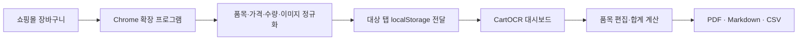

# CartOCR

쇼핑몰 장바구니를 결재 가능한 구매신청서로 바꾸는 브라우저 자동화 도구입니다. Chrome 확장 프로그램으로 품목을 수집하고, 웹 대시보드에서 수정한 뒤 PDF·Markdown·CSV로 내보낼 수 있습니다.

**[Web Dashboard](https://seung-won-yu.github.io/cart-ocr/)** · **Chrome Extension** · **Vanilla JavaScript** · **GitHub Pages**

## 한눈에 보기

| 입력 | 편집 | 출력 |
| --- | --- | --- |
| 쿠팡·디바이스마트·엘레파츠 장바구니 | 품명·수량·단가·썸네일 확인 및 수정 | 인쇄/PDF·Markdown 표·CSV |

## 주요 기능

- 지원 쇼핑몰의 상품명, 단가, 수량, 썸네일을 Chrome 확장 프로그램으로 수집
- 수집 결과를 URL에 싣지 않고 대상 탭의 `localStorage`로 전달
- 대시보드에서 품목을 직접 편집하고 총액을 실시간 계산
- 결재용 인쇄 레이아웃과 PDF 저장 지원
- Notion·Slack에 붙여 넣기 쉬운 Markdown 표 복사
- Excel에서 열기 쉬운 UTF-8 BOM CSV 다운로드
- 별도 애플리케이션 서버 없이 브라우저와 GitHub Pages에서 처리

## 처리 흐름


```mermaid
flowchart LR
    CART["쇼핑몰 장바구니"] --> EXT["Chrome 확장 프로그램"]
    EXT --> PARSE["품목·가격·수량·이미지 정규화"]
    PARSE --> STORE["대상 탭 localStorage 전달"]
    STORE --> APP["CartOCR 대시보드"]
    APP --> EDIT["품목 편집·합계 계산"]
    EDIT --> OUT["PDF · Markdown · CSV"]
```

브라우저 안에서 데이터를 처리하므로 별도 백엔드에 구매 목록을 저장하지 않습니다. 다만 쇼핑몰 페이지와 상품 이미지 자체는 각 원본 사이트에서 로드됩니다.

## 설치

1. 저장소를 내려받거나 [`extension.zip`](https://github.com/Seung-Won-Yu/cart-ocr/blob/main/extension.zip)을 압축 해제합니다.
2. Chrome에서 `chrome://extensions/`를 엽니다.
3. 오른쪽 위의 **개발자 모드**를 켭니다.
4. **압축해제된 확장 프로그램을 로드합니다**를 선택합니다.
5. 저장소의 `extension/` 폴더를 지정합니다.

## 사용 방법

1. 쿠팡, 디바이스마트 또는 엘레파츠 장바구니를 엽니다.
2. 브라우저 도구 모음에서 **CartOCR Scraper**를 실행합니다.
3. **장바구니 상품 수집**으로 결과를 확인합니다.
4. **CartOCR 앱으로 전송**을 누릅니다.
5. 열린 대시보드에서 품목을 다듬고 원하는 형식으로 내보냅니다.

쇼핑몰의 화면 구조가 변경되면 일부 항목은 자동 인식되지 않을 수 있습니다. 내보내기 전에 품명·수량·단가를 확인하세요.

## 로컬 실행

웹 대시보드는 정적 파일로 구성되어 있습니다.

```bash
python3 -m http.server 4173
```

브라우저에서 `http://localhost:4173/`를 엽니다. 로컬 대시보드와 확장 프로그램을 함께 사용하려면 `extension/manifest.json`의 허용 주소와 `extension/background.js`의 앱 주소를 로컬 URL에 맞춰야 합니다.

## 검증

Chrome과 Poppler의 `pdfinfo`가 설치된 macOS 환경에서:

```bash
node tests/run-content-parser-tests.js
```

이 스크립트는 쇼핑몰 fixture 파싱, 품목 합계, 대시보드 전달, 인쇄 DOM과 PDF 페이지 수를 확인합니다.

## 프로젝트 구조

```text
extension/          Manifest V3 확장 프로그램과 쇼핑몰 파서
index.html          웹 대시보드
app.js              품목 편집, 합계, 내보내기 로직
style.css           화면·인쇄 스타일
tests/              쇼핑몰 fixture와 브라우저 회귀 테스트
extension.zip       배포용 확장 프로그램 묶음
```

## 자체 배포

다른 GitHub Pages 주소로 배포하려면 다음 두 위치를 함께 변경합니다.

- `extension/manifest.json`: 새 Pages 도메인을 `host_permissions`에 추가
- `extension/background.js`: 대시보드를 여는 URL 변경

그 후 저장소 루트의 정적 파일을 GitHub Pages로 배포하고, 수정한 `extension/` 폴더를 Chrome에 다시 로드합니다.
